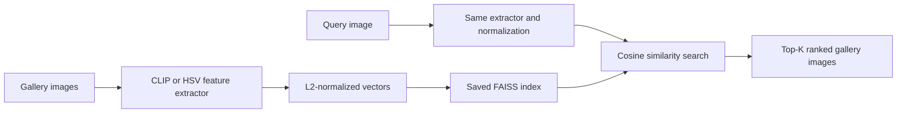

# Lookalike - Image Similarity Search System

Lookalike is a content-based image retrieval project for **Information Storage and Retrieval (ISR)**. Given an uploaded photo or an example image, it searches a local gallery and returns the most similar images in ranked order.

The project compares two ways of representing an image: a traditional **HSV color histogram** and a **pretrained CLIP image embedding**. Both use the same gallery, cosine similarity, and exact FAISS search, making their retrieval performance directly testable under the same evaluation protocol.

## Documentation

| Document | What it explains |
|---|---|
| [Project guide](docs/PROJECT_GUIDE.md) | Dataset selection, architecture, model, algorithms with formulas, worked examples, metrics, design choices, limitations, and viva questions |
| [Validation guide](docs/VALIDATION.md) | Verification commands, expected outputs, manual checks, recorded results, and troubleshooting |

## What the application does

- Accepts JPG, PNG, and WebP uploads or one of 100 held-out example queries.
- Returns the top 5, 10, or 20 matches from a 400-image gallery.
- Shows rank, similarity percentage, a visual score bar, and an image preview.
- Compares CLIP semantic retrieval with color-histogram retrieval.
- Refines results using images the user marks as relevant.
- Displays evaluation metrics, category results, timing, and downloadable CSV reports.
- Browses the collection and rebuilds saved indexes.

The frontend is plain HTML, CSS, and JavaScript. A local Python API uses Starlette, Uvicorn, ONNX Runtime, and FAISS. There is no frontend build step, paid API key, GPU requirement, or project-specific model training.

**Scope:** this searches the downloaded gallery. It does not search the internet or predict an object class. Displayed category names come from dataset metadata.

## How retrieval works



An image becomes a 512-dimensional vector. The query and gallery must use the same feature extractor. For query vector q and gallery vector x:

$$
s(q,x)=\frac{q^T x}{\|q\|_2\|x\|_2}
$$

After L2 normalization, this is simply the dot product. FAISS `IndexFlatIP` searches every gallery vector and returns the largest scores first. It is exact search, not approximate nearest-neighbor search.

The displayed percentage is `100 * cosine_similarity`. For example, a cosine score of `0.849` is shown as `84.9% similarity`. This is not an 84.9% probability that the result is correct. See the [algorithm explanations](docs/PROJECT_GUIDE.md#4-algorithms-and-formulas) for preprocessing, histogram construction, CLIP embeddings, ranking, and feedback.

## Dataset

Source: [Caltech-101 by imbikramsaha on Kaggle](https://www.kaggle.com/datasets/imbikramsaha/caltech-101).

The project selects 50 images from each of these 10 categories:

`airplanes`, `butterfly`, `car_side`, `cellphone`, `chair`, `cup`, `elephant`, `laptop`, `Motorbikes`, `watch`.

| Split | Per category | Total | Purpose |
|---|---:|---:|---|
| Gallery | 40 | 400 | Stored in the search index |
| Queries | 10 | 100 | Held-out examples and evaluation |
| Total | 50 | 500 | Small educational subset |

Selection uses seed 42, deterministic per-category shuffling, and exact-file SHA-256 deduplication. There is no training split because the pretrained model is used without fine-tuning. The source ZIP is about 137 MB; the selected image subset is about 6.1 MiB.

## Start after setup

If you have already completed setup, open a terminal in the project folder and run:

```powershell
.venv\Scripts\python.exe server.py
```

Open **http://127.0.0.1:8000** in your browser. Stop the server with **Ctrl+C**.
You do not need to reinstall dependencies or rebuild the indexes for each launch.

## Installation from a fresh clone

Use **Python 3.13 on Windows** for the tested setup. Run all commands below from the repository root. Downloads require internet during setup; normal searches work offline afterward.

### 1. Create the Python environment

```powershell
python -m venv .venv
.venv\Scripts\python.exe -m pip install --upgrade pip
.venv\Scripts\python.exe -m pip install -r requirements-lock.txt
```

`requirements-lock.txt` pins dependency versions. `requirements.txt` contains broader version ranges for resolving a compatible environment if a locked wheel is unavailable; run verification after using that fallback.

### 2. Prepare the dataset

Download the ZIP from the Kaggle source above. Create `data/raw/` and put the downloaded file there as `archive.zip`.

```powershell
.venv\Scripts\python.exe scripts/prepare_dataset.py --archive data/raw/archive.zip
.venv\Scripts\python.exe scripts/verify_dataset.py
```

Alternatively, use `scripts/prepare_dataset.py --download`. If Kaggle requires sign-in or blocks this download, use the manual ZIP method.

The preparation script creates `data/caltech101-small/` with gallery images, query images, a manifest, and dataset metadata. It refuses to overwrite a nonempty output folder. On an existing installation, verify and reuse the prepared dataset rather than preparing it again.

### 3. Download the pretrained model

```powershell
.venv\Scripts\python.exe scripts/download_model.py
```

The repository includes the model in `models/`. Run this command to verify the existing file or download it if missing. The downloader obtains the approximately 89 MB quantized CLIP vision encoder from [Xenova/clip-vit-base-patch32](https://huggingface.co/Xenova/clip-vit-base-patch32). The downloader pins a specific revision and verifies SHA-256. It does not train a model. If parallel range downloads fail, retry with `--workers 1`.

### 4. Build the indexes and generate evaluation reports

```powershell
.venv\Scripts\python.exe scripts/build_index.py --method all
.venv\Scripts\python.exe scripts/evaluate.py --method all
```

This creates both 400-image indexes under `indexes/` and evaluation JSON/CSV files under `artifacts/`. Only gallery images are indexed.

### 5. Verify and start the app

```powershell
.venv\Scripts\python.exe -B -m pytest -q -p no:cacheprovider
.venv\Scripts\python.exe server.py
```

Open **[http://127.0.0.1:8000](http://127.0.0.1:8000)**. Stop the server with Ctrl+C.

After setup, double-click `run.bat` or run `.\run.ps1` for subsequent launches. Do not open `frontend/index.html` directly: the interface needs the Python API.

### Other environments and partial setup

On macOS/Linux, create the environment with `python3 -m venv .venv` and use `.venv/bin/python` instead of `.venv\Scripts\python.exe`. These platforms have not been validated here. Python 3.11-3.13 is the intended range, subject to dependency wheel availability.

A histogram-only experiment can skip model download and use `--method histogram` when building and evaluating. Select the color method in the UI. Full comparison and integration tests need both methods and their generated assets.

## Using the app

1. Choose an example category or upload a photo.
2. Select the retrieval method and number of results.
3. Click **Find similar images** and inspect the ranking and previews.
4. Select relevant cards with their `+` buttons and refine the results.
5. Use **Compare methods** to compare the two representations for the same query.
6. Use **Evaluation** for retrieval metrics and **Collection** to browse the dataset.

Query images are processed locally and are not saved into the gallery. The server binds to localhost. There is no authentication or public-hosting configuration.

## Recorded results

Results below were recorded on 18 September 2026 using 100 held-out queries. A result is relevant when its category equals the query category.

| Method | Precision@5 | Precision@10 | Recall@10 | mAP@10 | NDCG@10 | Mean latency |
|---|---:|---:|---:|---:|---:|---:|
| HSV histogram | 0.294 | 0.297 | 0.0743 | 0.2127 | 0.3082 | 6.1 ms |
| CLIP INT8 ONNX | 0.988 | 0.985 | 0.2463 | 0.9790 | 0.9853 | 40.9 ms |

The CLIP result means an average of 9.85 relevant images among the top 10 on this subset. It does not mean 98.5% recognition accuracy for arbitrary photos. Recall@10 cannot exceed 0.25 here because every query has 40 relevant gallery images.

Latency includes warm image decoding, encoding, and search, but excludes model initialization and browser rendering. Your timings may differ. Metric formulas and a numerical example are in the [project guide](docs/PROJECT_GUIDE.md#5-evaluation-with-formulas).

## Project structure

```text
frontend/                   HTML, CSS, JavaScript, and favicon
server.py                   Starlette API and static-file serving
isr/config.py               Paths, feature versions, and category names
isr/dataset.py              Manifest, integrity checks, and dataset fingerprint
isr/features.py             Image validation, HSV features, CLIP inference
isr/retrieval.py            Index building, exact search, relevance feedback
isr/evaluation.py           Metrics, timings, and reports
scripts/                    Dataset/model preparation and reproducible commands
tests/                      Core retrieval tests and API integration tests
docs/                       Technical guide and validation instructions
requirements.txt            Dependency version ranges
requirements-lock.txt       Pinned dependencies
run.bat / run.ps1            Windows launchers
data/                       Local dataset and archive (ignored by Git)
models/                     Pretrained weights and provenance (included in repository)
indexes/                    Generated indexes (ignored by Git)
artifacts/                  Generated reports and previews (ignored by Git)
```

## Publishing to a new repository

Commit source code, scripts, tests, requirements, launchers, and documentation. The `models/` folder is included in the repository. `.gitignore` excludes datasets, generated indexes and reports, virtual environments, caches, and local secrets. A fresh clone must prepare the dataset and regenerate indexes and reports.

When ready to publish to your own empty repository:

```powershell
git init
git add .
git status --short
git diff --cached --stat
git commit -m "Initial image similarity search project"
git branch -M main
git remote add origin YOUR_NEW_REPOSITORY_URL
git push -u origin main
```

Replace the placeholder with your repository URL and review staged files before committing. Ignore rules do not remove already-tracked files; use `git rm --cached` on a file, or `git rm -r --cached` on a directory, if you need to untrack it while preserving local copies.

## Limitations and attribution

The collection has only ten categories. Category equality is an imperfect proxy for visual resemblance. Exact-file duplicates are removed, but near duplicates and possible CLIP pretraining overlap have not been exhaustively checked. Results are an educational experiment, not an official Caltech benchmark.

Credit the [dataset source](https://www.kaggle.com/datasets/imbikramsaha/caltech-101), [CLIP authors](https://arxiv.org/abs/2103.00020), and [ONNX model export](https://huggingface.co/Xenova/clip-vit-base-patch32). Dataset images and model weights retain their source terms. Choose a license for your own code before public release.
