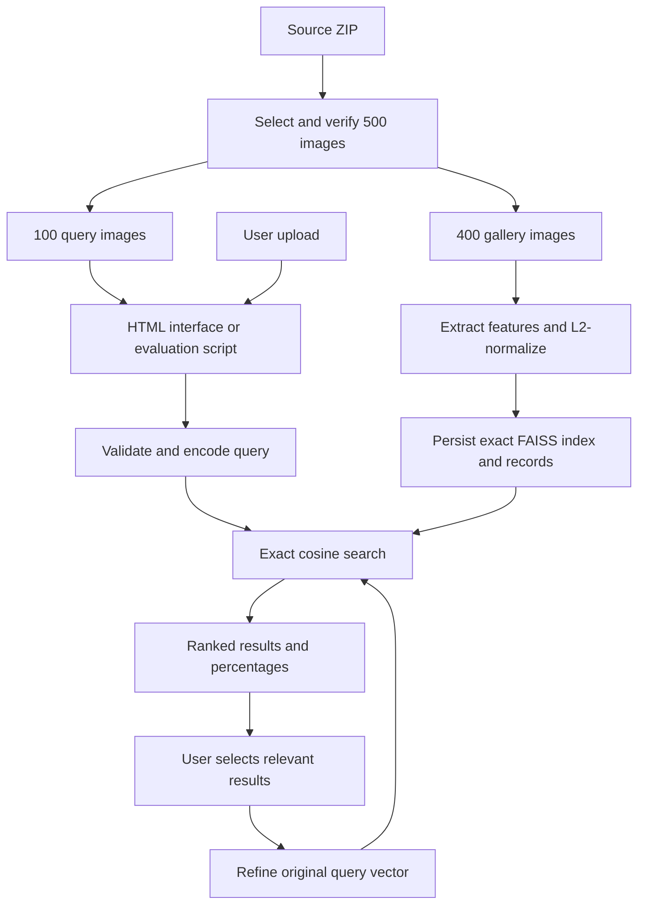

# Project Guide - Lookalike

This document explains the implemented Image Similarity Search System for an Information Storage and Retrieval PBL submission. The formulas describe the code in this repository, including its specific evaluation conventions.

## Contents

1. [Problem and objectives](#1-problem-and-objectives)
2. [Dataset and experimental protocol](#2-dataset-and-experimental-protocol)
3. [Architecture](#3-architecture)
4. [Algorithms and formulas](#4-algorithms-and-formulas)
5. [Evaluation with formulas](#5-evaluation-with-formulas)
6. [Results and interpretation](#6-results-and-interpretation)
7. [Implementation and API](#7-implementation-and-api)
8. [Installation and verification](#8-installation-and-verification)
9. [Limitations and future work](#9-limitations-and-future-work)
10. [Syllabus alignment and viva](#10-syllabus-alignment-and-viva)

## 1. Problem and objectives

A filename or text tag may not describe what an image looks like. Content-based image retrieval (CBIR) searches using features extracted from the image itself.

Given a query image, this system must retrieve existing gallery images, order them by similarity, and let the user inspect or refine the ranking. It compares a simple color representation with a pretrained semantic representation and measures both under the same protocol.

The project contribution is the complete retrieval pipeline: data preparation, representations, indexing, query processing, feedback, evaluation, and interface. It does not train CLIP or claim a new neural architecture.

Retrieval differs from classification. A classifier assigns a class; this system returns actual gallery images. The label on a result card comes from its saved dataset record, not a newly predicted class.

## 2. Dataset and experimental protocol

Source: [Caltech-101 on Kaggle](https://www.kaggle.com/datasets/imbikramsaha/caltech-101).

| Property | Project value |
|---|---|
| Selected categories | airplanes, butterfly, car_side, cellphone, chair, cup, elephant, laptop, Motorbikes, watch |
| Images per category | 50 |
| Gallery per category | 40 |
| Queries per category | 10 |
| Total | 500 images: 400 gallery and 100 queries |
| Selection seed | 42 |
| Training | None; pretrained encoder is frozen |

### Selection procedure

`scripts/prepare_dataset.py` sorts archive filenames for each category, shuffles them with a category-specific generator seeded by the string `42:category`, and takes the first 50 distinct file hashes. A shared SHA-256 set prevents selected exact-file duplicates across categories as well. The first 40 selected images become gallery records; the remaining 10 become query records.

The manifest records relative path, category, split, SHA-256, and original archive member. `dataset_info.json` records source information, archive checksum, counts, seed, and assumptions. The same archive and script produce the same selection.

Only the gallery is indexed. Query images are held out from that index so evaluation does not retrieve the query itself. This is a gallery/query split, not a training/test split for fine-tuning.

A relevant result is defined as a gallery image with the same category as the query. Therefore every evaluation query has 40 relevant gallery images. Labels are used to measure relevance and display captions; they are not inputs to the feature extractor or ranking calculation.

### Why this dataset size?

The subset is small enough for quick CPU experiments, balanced enough for simple category-level comparisons, and varied enough to demonstrate the difference between color and semantic features. These conveniences also limit the conclusions: it is not the official Caltech benchmark protocol and cannot establish broad real-world accuracy.

## 3. Architecture



There are two stages. **Offline indexing** encodes the gallery once and saves its vectors and metadata. **Online retrieval** encodes only the current query and searches the saved index. This avoids re-encoding all images on every request.

The plain HTML/CSS/JavaScript frontend calls a local Starlette API served by Uvicorn. ONNX Runtime executes CLIP on CPU. FAISS performs vector search. NumPy handles numerical operations, Pillow decodes images, and pandas produces evaluation tables.

## 4. Algorithms and formulas

### 4.1 Notation

| Symbol | Meaning |
|---|---|
| I | An input image |
| N | Number of gallery images, 400 |
| d | Feature dimension, 512 |
| f(I) | Feature extractor output |
| q | Normalized query vector |
| x_i | Normalized vector for gallery image i |
| K | Number of returned results |
| R | Number of relevant gallery images for a query, 40 |
| Q | Number of evaluation queries, 100 |
| r_i | Binary relevance of the result at rank i |

### 4.2 Input validation and decoding

`open_rgb` in `isr/features.py` corrects EXIF orientation and converts decoded images to RGB. It rejects unreadable input, uploads larger than 10 MiB, images above 20 million pixels, a dimension above 20,000 pixels, and aspect ratios above 50:1.

These checks happen before feature extraction. The model receives image pixels, not compressed JPEG bytes. File hashes identify exact duplicates; they do not measure semantic similarity. A resized copy can have different file bytes while depicting the same object.

### 4.3 HSV color-histogram baseline

**Purpose:** represent how much of each color combination occurs in an image.

The implementation shrinks the image to fit within 256 by 256 pixels while preserving aspect ratio, converts it to Pillow's 8-bit HSV representation, and divides each channel into eight equal bins over [0,256). For a channel value c:

$$
b(c)=\left\lfloor\frac{8c}{256}\right\rfloor,\qquad c\in\{0,\ldots,255\}
$$

For a pixel p with channels H, S, and V, count its joint bin:

$$
h_{a,b,c}=\sum_{p\in I}\mathbf{1}\left[b(H_p)=a\;\land\;b(S_p)=b\;\land\;b(V_p)=c\right]
$$

Here a, b, and c range from 0 to 7, and the indicator is 1 when all conditions hold. Flattening this joint histogram gives:

$$
d=8\times8\times8=512
$$

The flattening uses the H/S/V axis order, with flat position `64*a + 8*b + c`. Counts are L2-normalized before comparison.

**Example:** two images dominated by blue sky can have similar histograms even if one contains an airplane and the other contains a bird. The histogram ignores where colors occur and what object they form.

**Why use it?** It is inexpensive, interpretable, and provides a baseline. Its weaknesses make the benefit of richer image representations measurable.

Code: `histogram` in `isr/features.py`.

### 4.4 Pretrained CLIP image embeddings

**Purpose:** represent visual content using features learned before this project.

The project uses the quantized ONNX vision encoder from [Xenova/clip-vit-base-patch32](https://huggingface.co/Xenova/clip-vit-base-patch32), based on [CLIP](https://arxiv.org/abs/2103.00020). CLIP's original image-text training motivates semantic embeddings; this application uses only its image encoder. There is no text encoder, contrastive training loop, or fine-tuning in this repository.

| Model property | Value |
|---|---|
| Architecture family | CLIP ViT-B/32 |
| Export | `onnx/vision_model_quantized.onnx` |
| Revision | `d15189d7028b43f1d3e65039190477f6af591c2a` |
| SHA-256 | `583fd1110a514667812fee7d684952aaf82a99b959760c8d7dca7e0ab9839299` |
| Runtime | ONNX Runtime, CPUExecutionProvider |
| Input name and shape | `pixel_values`, batch x 3 x 224 x 224 |
| Output name and size | `image_embeds`, 512 values per image |

Preprocessing converts to RGB, bicubic-resizes the shortest edge to 224, and center-crops to 224 by 224. Each channel is rescaled and standardized:

$$
z_{c,u,v}=\frac{I_{c,u,v}/255-\mu_c}{\sigma_c}
$$

The channel constants, in RGB order, are:

```text
mean = [0.48145466, 0.4578275, 0.40821073]
std  = [0.26862954, 0.26130258, 0.27577711]
```

The tensor uses float32 values in channel-first layout. The encoder produces a projected embedding:

$$
v=f_\theta(z)\in\mathbb{R}^{512}
$$

The parameters theta are fixed pretrained weights. ViT-B/32 refers to a base Vision Transformer with 32-pixel patches. At 224 by 224 input resolution, the image supplies a 7 by 7 grid of patches. The exported network handles its internal transformer processing; the application consumes its projected output rather than classification probabilities.

**Why pretrained and quantized?** The small dataset is intended for retrieval evaluation, not training a large vision model. A quantized export reduces weight size and supports a CPU demonstration. Quantization may alter embeddings relative to full precision; this project does not measure that difference.

Code: `clip_pixels`, `Encoder`, and `_session` in `isr/features.py`.

### 4.5 L2 normalization

Both methods normalize their output vector v:

$$
\|v\|_2=\sqrt{\sum_{j=1}^{d}v_j^2},\qquad \hat v=\frac{v}{\|v\|_2}
$$

**Example:** the vector [3,4] has norm 5, so its normalized form is [0.6,0.8]. Its length becomes 1 while its direction stays the same.

This makes inner-product ranking equivalent to cosine ranking. The implementation rejects nonfinite vectors and norms at or below 1e-12 instead of dividing by zero.

Both extractors output 512 dimensions, but those dimensions mean different things. A CLIP query must never search the histogram index, or vice versa.

### 4.6 Cosine similarity and ranking

For arbitrary nonzero vectors, cosine similarity is:

$$
s(q,x_i)=\frac{q^T x_i}{\|q\|_2\|x_i\|_2}
$$

Because stored vectors and queries have unit length:

$$
s(q,x_i)=q^Tx_i=\sum_{j=1}^{d}q_jx_{ij}
$$

The result set consists of the K gallery vectors with the greatest scores:

$$
\operatorname{Results}(q)=\operatorname{TopK}_{i\in\{1,\ldots,N\}}\;s(q,x_i)
$$

**Worked example using two-dimensional unit vectors:**

| Vector | Coordinates | Similarity to q = [0.6,0.8] | Rank |
|---|---|---:|---:|
| A | [0.6,0.8] | 0.6*0.6 + 0.8*0.8 = 1.00 | 1 |
| B | [1,0] | 0.6*1 + 0.8*0 = 0.60 | 2 |
| C | [0,-1] | 0.6*0 + 0.8*(-1) = -0.80 | 3 |

A higher value means closer vector direction. Cosine lies in [-1,1]; nonnegative histogram vectors produce nonnegative cosine values. Scores from CLIP and HSV are not calibrated to each other, even though both use cosine.

The interface displays:

$$
\operatorname{displayPercent}=100\,s(q,x_i)
$$

It rounds to one decimal place. A score of 0.849 becomes 84.9%, not a probability of correctness. The bar displays only the positive portion, bounded to 0-100; a negative score remains negative in the number. Preview dialogs also show raw cosine, and result CSV files export the raw score.

### 4.7 FAISS exact indexing

`IndexFlatIP` stores the gallery matrix and searches with inner products. It examines the entire gallery; using FAISS does not automatically make retrieval approximate.

```text
BUILD(method):
    load and verify manifest
    select gallery records only
    encode gallery images in batches of eight
    L2-normalize the vectors
    create IndexFlatIP with dimension 512
    add vectors in the same order as the saved records
    save index, vectors, records, and integrity metadata

SEARCH(image, method, K):
    decode and validate image
    encode with the extractor used to build that index
    L2-normalize query
    search for min(K, gallery size) largest inner products
    map vector IDs back to gallery records
    return scores, ranks, and image metadata
```

Scoring one query costs O(Nd), excluding feature extraction and top-K selection overhead. Vector storage is O(Nd). Here, the float32 vector payload is:

$$
400\times512\times4=819200\text{ bytes}
$$

The recorded FAISS file is 819,245 bytes. The companion vector file, metadata, images, and model consume additional space. `vectors.npy` retains vectors for relevance feedback. `records.json` maps IDs to images. `metadata.json` records feature version, model hash, dataset fingerprint, counts, and file hashes. Inconsistent or stale assets are rejected on load.

Exact search is appropriate for 400 images. IVF or HNSW could be evaluated on a much larger collection, but neither is implemented here.

Code: `build_index` and `SearchIndex` in `isr/retrieval.py`.

### 4.8 Explicit relevance feedback

The user can select retrieved images that better express the intended similarity. Let P be the set of selected positive vectors. First compute their mean:

$$
c_P=\frac{1}{|P|}\sum_{x\in P}x
$$

Then combine it with the original normalized query and normalize again:

$$
q'=\frac{0.7q+0.3c_P}{\|0.7q+0.3c_P\|_2}
$$

This is a positive-only, Rocchio-style query update in embedding space. It has no negative-feedback term. The coefficient 0.3 is a fixed implementation choice, not a value optimized by this experiment.

**Example:** if q=[1,0] and the one selected vector is [0,1], the unnormalized update is [0.7,0.3]. Its norm is approximately 0.7616, giving q' approximately [0.9191,0.3939]. The new query moves toward the selected result while retaining the original direction.

The index and model do not change. Reset returns to the original query. Feedback uses the original query rather than accumulating an unlimited sequence of modifications. Automated evaluation uses unrefined queries so the two methods are compared under the same conditions.

Code: `refine_query` in `isr/retrieval.py` and feedback handling in `server.py`.

## 5. Evaluation with formulas

For a query, define relevance at rank i as:

$$
r_i=\begin{cases}1&\text{if result category equals query category}\\0&\text{otherwise}\end{cases}
$$

The evaluation script requests 10 results for each of 100 held-out queries. It computes each metric per query, then averages over queries. This is implemented in `metrics` and `evaluate` in `isr/evaluation.py`.

### Precision@K

$$
P@K=\frac{1}{K}\sum_{i=1}^{K}r_i
$$

Precision answers: what fraction of the retrieved results are relevant? The project reports P@5 and P@10.

### Recall@10

$$
\operatorname{Recall}@10=\frac{\sum_{i=1}^{10}r_i}{R}
$$

Recall answers: what fraction of all relevant gallery images were retrieved? R=40 here, so even 10 relevant results yield only 10/40=0.25 recall. This ceiling is a consequence of the cutoff, not an implementation error.

### F1@10

$$
F1@10=\frac{2(P@10)(\operatorname{Recall}@10)}{P@10+\operatorname{Recall}@10}
$$

It is zero if both inputs are zero. The script calculates F1 per query and averages those values; it does not generally define the reported value as F1 computed from the two aggregate means.

### AP@10 and mAP@10

Precision at an intermediate rank i is:

$$
P@i=\frac{\sum_{j=1}^{i}r_j}{i}
$$

This implementation uses the following truncated average precision convention:

$$
AP@10=\frac{\sum_{i=1}^{10}(P@i)r_i}{\min(R,10)}
$$

$$
mAP@10=\frac{1}{Q}\sum_{q=1}^{Q}AP@10(q)
$$

Only relevant ranks contribute. Earlier relevant results improve precision at those ranks. The denominator is min(R,10), not R; other implementations may use another convention, so state this explicitly when comparing reports. With this convention, ten relevant top results give AP@10=1 even though recall is 0.25.

### Reciprocal rank and MRR@10

Let j be the first relevant rank within the top 10:

$$
RR@10=\begin{cases}1/j&\text{if such a rank exists}\\0&\text{otherwise}\end{cases}
$$

$$
MRR@10=\frac{1}{Q}\sum_{q=1}^{Q}RR@10(q)
$$

This focuses on how soon the first useful result appears. In per-query output the field is named `mrr_at_10`, although its value is that query's reciprocal rank; averaging produces MRR.

### NDCG@10

With binary relevance, discounted cumulative gain is:

$$
DCG@10=\sum_{i=1}^{10}\frac{r_i}{\log_2(i+1)}
$$

An ideal ranking places relevant images first:

$$
IDCG@10=\sum_{i=1}^{\min(R,10)}\frac{1}{\log_2(i+1)},\qquad NDCG@10=\frac{DCG@10}{IDCG@10}
$$

NDCG rewards relevant images near the top and normalizes against the best possible ranking. Because relevance is binary, the common gain expression 2^r-1 reduces to r.

### Worked metric example

Suppose only ranks 1 and 3 are relevant among the top 10:

```text
Rank:       1 2 3 4 5 6 7 8 9 10
Relevance:  1 0 1 0 0 0 0 0 0  0
```

With R=40:

| Metric | Calculation | Value |
|---|---|---:|
| P@5 | 2/5 | 0.4000 |
| P@10 | 2/10 | 0.2000 |
| Recall@10 | 2/40 | 0.0500 |
| F1@10 | 2*0.2*0.05/(0.2+0.05) | 0.0800 |
| AP@10 | (1/1 + 2/3)/10 | 0.1667 |
| RR@10 | 1/1 | 1.0000 |
| DCG@10 | 1/log2(2) + 1/log2(4) | 1.5000 |
| IDCG@10 | sum of 1/log2(i+1), i=1..10 | 4.5436 |
| NDCG@10 | 1.5/4.5436 | 0.3301 |

This illustrates why multiple metrics are useful: the first result is relevant, so RR is perfect, while most of the retrieved list is irrelevant. The core test suite checks this ranking against known metric values.

### Timing protocol

The evaluation initializes the model and index, then performs one warm-up encoding. For each measured query:

$$
T_{total}=T_{decode}+T_{encode}+T_{search}
$$

Search timing includes vector search and result mapping. Reports contain mean component timings and the 95th percentile of total query time. Loading the model, loading the index, browser requests, and rendering are outside this timed section.

## 6. Results and interpretation

Recorded on 18 September 2026 from the local `artifacts/evaluation.json`:

| Method | P@5 | P@10 | Recall@10 | F1@10 | mAP@10 | MRR@10 | NDCG@10 | Mean time |
|---|---:|---:|---:|---:|---:|---:|---:|---:|
| HSV | .294 | .297 | .07425 | .1188 | .21266 | .49398 | .30818 | 6.11 ms |
| CLIP | .988 | .985 | .24625 | .3940 | .97898 | .99000 | .98527 | 40.93 ms |

CLIP retrieves more same-category images on this subset, at higher feature-extraction cost. The difference is consistent with semantic embeddings containing more useful category information than color counts for this task. It does not isolate every possible cause or prove that CLIP will win on every dataset.

Precision@10=.985 means 9.85 relevant images per top-10 list on average. It is not the probability that any uploaded image is recognized correctly. Similarity percentages shown on individual cards are a separate quantity from these evaluation metrics.

Generated outputs are `evaluation.json`, `evaluation-queries.csv`, `evaluation-categories.csv`, and `evaluation-summary.csv`. The repository ignores those runtime files; regenerate them using the evaluation command. Reported timings are machine-specific.

## 7. Implementation and API

| Module | Responsibility |
|---|---|
| `isr/dataset.py` | Manifest validation, file hashes, split separation, safe paths, fingerprint |
| `isr/features.py` | Validation, preprocessing, both feature extractors, normalization |
| `isr/retrieval.py` | Index persistence, integrity checks, search, feedback |
| `isr/evaluation.py` | Metrics, timings, category and overall reports |
| `server.py` | HTTP API, static files, upload handling, cached engine, feedback tokens |
| `frontend/` | Query controls, ranked results, preview, comparison, evaluation, collection |

| HTTP route | Function |
|---|---|
| `GET /api/overview` | Collection and method availability |
| `POST /api/search` | Search by uploaded image or held-out query ID |
| `POST /api/feedback` | Refine or reset a prior query |
| `GET /api/images/{image_id}` | Serve a permitted dataset image |
| `GET /api/collection` | Browse paginated records |
| `GET /api/evaluation` | Read a saved report |
| `POST /api/evaluation` | Recompute evaluation |
| `POST /api/indexes/{method}/build` | Rebuild an index |
| `GET /api/download/{name}` | Export supported generated reports |

Feedback tokens expire after 30 minutes, with at most 128 recent vector records retained. Restarting the server clears them. Uploads are processed locally without adding them to the collection or transmitting them to a model service.

## 8. Installation and verification

Follow the ordered commands in the [README](../README.md#installation-from-a-fresh-clone). The required sequence is environment installation, dataset preparation, dataset verification, model download, indexing, evaluation, tests, then server startup.

The [validation guide](VALIDATION.md) explains each check and expected output. Both methods and generated reports are required for the full integration suite. For a source-only core check after dependency installation, run:

```powershell
.venv\Scripts\python.exe -B -m pytest tests/test_retrieval.py -q -p no:cacheprovider
```

Source changes in the frontend require a browser refresh. Python changes require a server restart. Changes to gallery content, features, or model weights require rebuilding affected indexes and regenerating evaluation results.

## 9. Limitations and future work

Category labels are a convenient but imperfect measure of visual similarity. Ten broad categories make retrieval easier than distinguishing fine-grained object variants. Exact hashes do not catch all resized or cropped duplicates. CLIP pretraining overlap with this public dataset is unknown. Center cropping may remove important off-center objects, and backgrounds can affect both representations.

The app always returns nearest neighbors, including for objects outside the collection. It has no calibrated rejection threshold. Its local processing limits external data sharing, but there is no authenticated public deployment design.

Possible future work includes near-duplicate analysis, human relevance judgments, larger datasets, approximate index comparisons, text-to-image search with a compatible text encoder, and deployment controls. None of these should be presented as implemented features.

## 10. Syllabus alignment and viva

| Syllabus area | Implemented connection |
|---|---|
| Unit I | Retrieval pipeline, representations, similarity |
| Unit II | Dense vector indexing and ranked search |
| Unit III | Explicit relevance feedback and query refinement |
| Unit IV | Precision, recall, F1, MAP, MRR, NDCG, timing, interface |
| Unit V | Local processing and transparent scores; crawling/PageRank are not implemented |
| Unit VI | Multimedia retrieval and pretrained neural embeddings |

**Why not compare image bytes?** Byte equality detects exact files, while perceptual similarity must survive changes such as compression or resizing.

**Why use a pretrained model?** It provides learned features without training a large network on a small collection. The experiment evaluates their use in retrieval.

**Why keep a histogram baseline?** It establishes what a simple, inexpensive representation achieves under the same protocol.

**Why FAISS instead of a hosted vector database?** Exact local search is sufficient for 400 images and avoids an unnecessary service dependency.

**Why normalize?** Unit-length vectors let inner products implement cosine similarity directly.

**Does feedback train CLIP?** No. It changes the query vector and reruns search against unchanged gallery vectors.

**Why is maximum recall only 25%?** There are 40 relevant gallery images, but only 10 results are evaluated.

**Is the similarity percentage confidence?** No. It is a scaled cosine score, not a calibrated probability.

## References and ownership

- [Selected dataset](https://www.kaggle.com/datasets/imbikramsaha/caltech-101)
- [CLIP research paper](https://arxiv.org/abs/2103.00020)
- [ONNX model export](https://huggingface.co/Xenova/clip-vit-base-patch32)

Model weights and dataset images retain their source terms. Attribute their creators and distinguish externally pretrained components from the retrieval system implemented for this project.
